# Getting Started

Welcome to WorkDock.

This guide will take you from a fresh Docker host to a fully running WorkDock instance — including the database, secrets management, observability, integrations, and the WorkDock engine itself.

You don't need to assemble the infrastructure manually. WorkDock's deployment scripts take care of that for you.

The installation happens in **two phases**:

1. **Bring up the infrastructure** — PostgreSQL, Redis, Infisical, and SigNoz.
2. **Connect your integrations and start WorkDock** — once the required credentials are in place, the script handles migrations, configuration, and starts the engine.

By the end, you'll have a WorkDock instance ready to receive and process tickets from Linear.

## Before you begin

Make sure your machine has:

- [Docker](https://docs.docker.com/get-docker/) with Docker Compose
- `openssl` — used to generate local secrets during installation
- `curl` — used by the deployment script for health checks
- A **publicly accessible HTTPS domain** pointing to your WorkDock instance

The public URL is important because Linear and GitHub need to reach your WorkDock instance for webhooks and OAuth callbacks.

If you don't already have a public endpoint, [Cloudflare Tunnel](https://developers.cloudflare.com/tunnel/) is a convenient way to securely expose your local or private service without opening inbound ports.

::: tip
You can start with a local installation and use a tunnel for the public endpoints required by Linear and GitHub.
:::

## 1. Clone WorkDock

Start by getting the WorkDock repository:

```bash
git clone https://github.com/workdock-dev/engine.git
cd engine
```

That's all you need to do here. The deployment script will take care of the rest.

## 2. Start the installation

Now let's bring the foundation of WorkDock online.

Run:

```bash
./scripts/docker-up.sh
```

### What happens on the first run?

The first run intentionally **doesn't start WorkDock yet**.

Instead, the script prepares everything WorkDock needs to run:

1. Creates `.env` from `.env.example`.
2. Generates the local secrets required by Infisical and SigNoz.
3. Starts PostgreSQL, Redis, Infisical, SigNoz, ClickHouse, ClickHouse Keeper, and the OpenTelemetry Collector.
4. Checks which WorkDock configuration values are still missing.
5. Stops before starting the WorkDock engine.

You'll see a message similar to:

```text
Infrastructure is running, but WorkDock has not been started.

Open Infisical at http://localhost:8081, create the administrator,
project, and Universal Auth client.

Then add the following to .env, place the GitHub App key in
docker/workdock/github-app.pem, and rerun this script:

  WORKDOCK_LINEAR_WEBHOOK_SECRET
  WORKDOCK_LINEAR_API_KEY
  ...
```

::: tip
**This is expected.** Leave the infrastructure running and continue with the configuration below. You will run `docker-up.sh` again after all integrations are configured.
:::

# 3. Connect WorkDock to its services

WorkDock relies on a few external services to receive work, access repositories, manage secrets, and run isolated environments.

We'll configure them one at a time.

## 3.1 Set up Infisical

WorkDock uses [Infisical](https://infisical.com) as its secrets manager.

This is where WorkDock securely stores runtime credentials such as Linear OAuth tokens and GitHub installation tokens. Rather than putting these credentials directly into configuration files, WorkDock retrieves them from Infisical when they're needed.

### Create your Infisical project

Open:

**http://localhost:8081**

Complete the initial Infisical setup:

1. Create the **administrator account** with your email address and a password.

   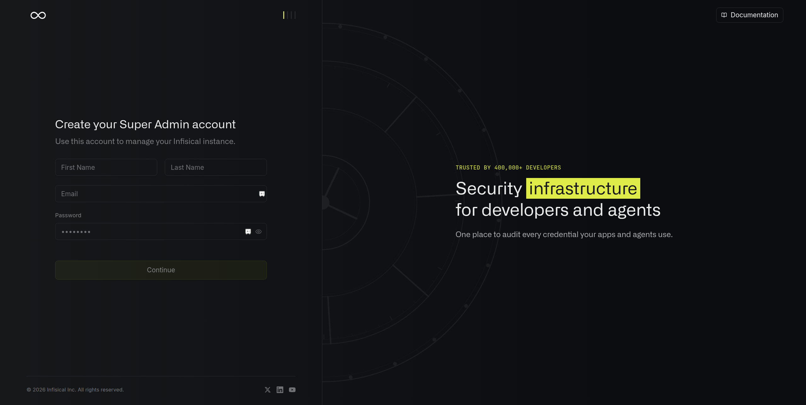

2. Create an **organization**. You can choose any name you like.

   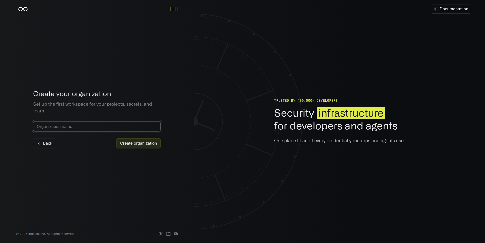

3. Complete the onboarding flow using the default options.

4. From the Infisical home screen, open **Secret Management**.

   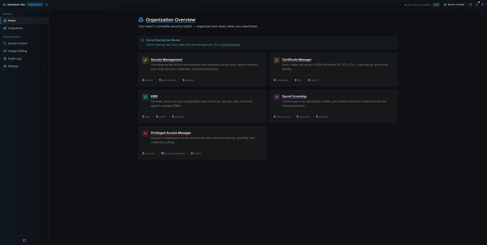

5. Click **Create Project**, choose a project name, and create it.

   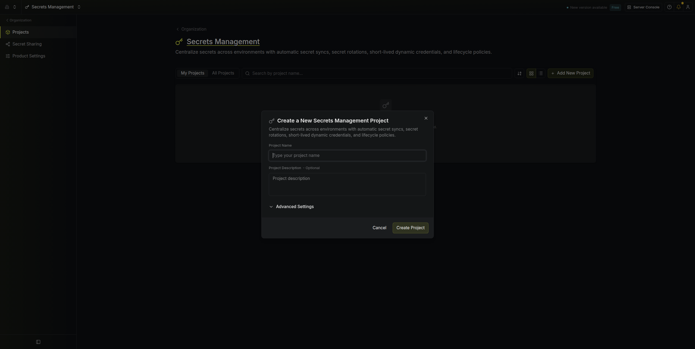

### Create WorkDock's secret folders

Open the project you just created.

From **Add Secret**, select **Add Folder** and create:

```text
/linear/oauth
/github/installations
```

::: warning
These folder paths are required by WorkDock and **must use these exact names**. They are not configurable.
:::

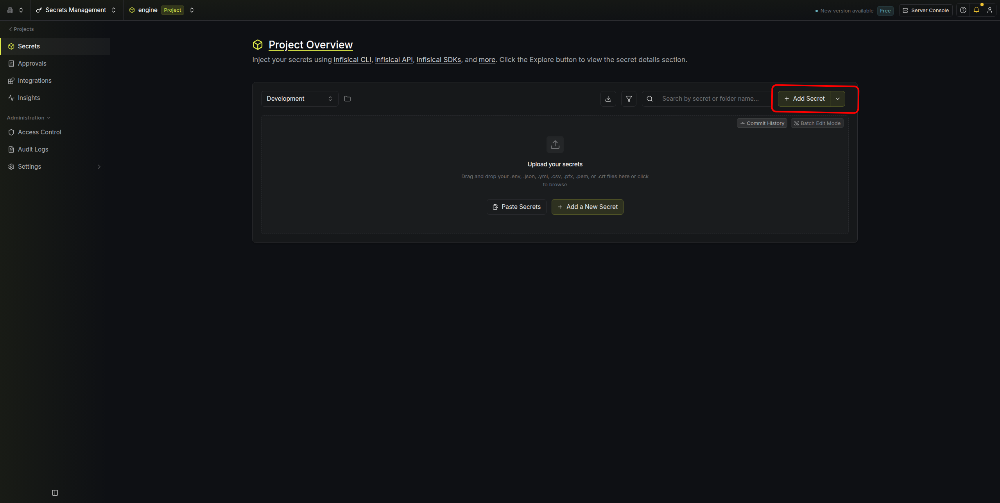

### Create a machine identity

WorkDock needs its own machine identity so the engine can authenticate with Infisical without requiring a human login.

1. In the project sidebar, open **Access Control → Machine Identities** and click **Add Machine Identity**.
2. Give it any name you like, select **Member** as the role, and create it.

   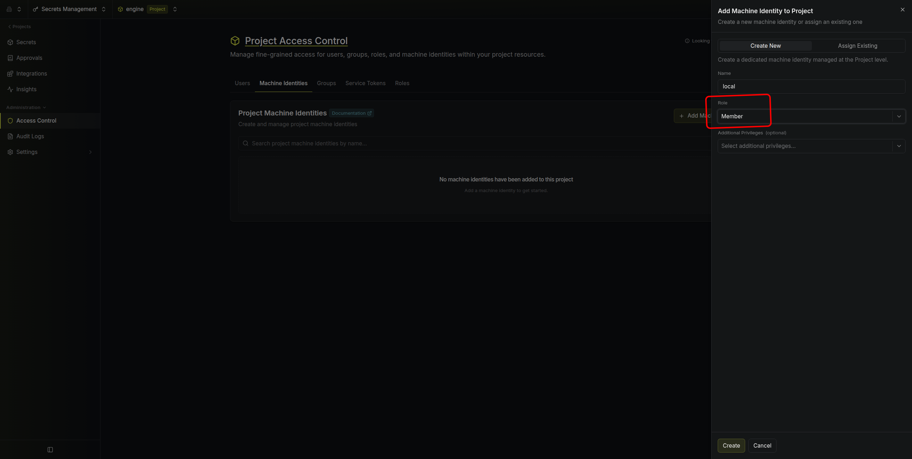

3. After creation, open **Universal Auth → View Auth Method**.

   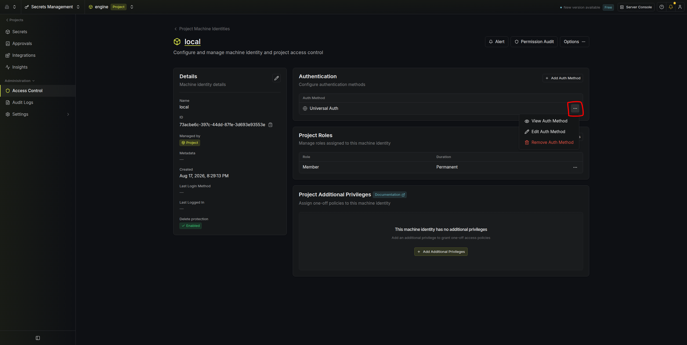

4. Copy the **Client ID** into:

   ```text
   WORKDOCK_INFISICAL_CLIENT_ID
   ```

5. Click **Create Client Secret**, optionally provide a description, and copy the generated secret into:

   ```text
   WORKDOCK_INFISICAL_CLIENT_SECRET
   ```

   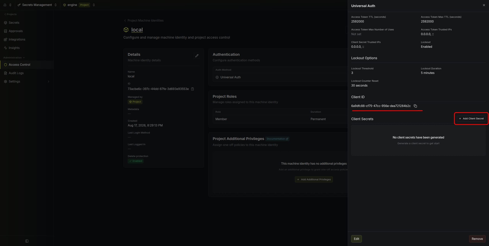

::: warning
Copy the client secret when it is generated. You may not be able to retrieve the same secret again later.
:::

Finally, open the project's **Settings** and click **Copy Project ID**.

Add it to `.env` as:

```text
WORKDOCK_INFISICAL_PROJECT_ID
```

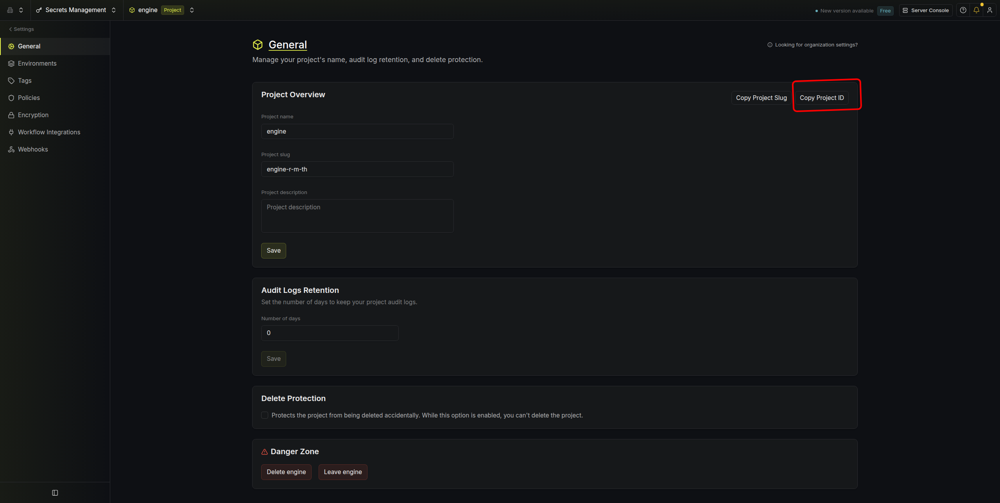

::: tip
At this point, WorkDock has everything it needs to authenticate with Infisical and access its runtime secrets.
:::

## 3.2 Connect Linear

Linear is where WorkDock receives the work it needs to execute.

You'll create a Linear OAuth application so WorkDock can connect to a workspace and receive the events it needs to process tickets.

::: info
For more information about Linear OAuth applications, see the [Linear API documentation](https://developers.linear.dev).
:::

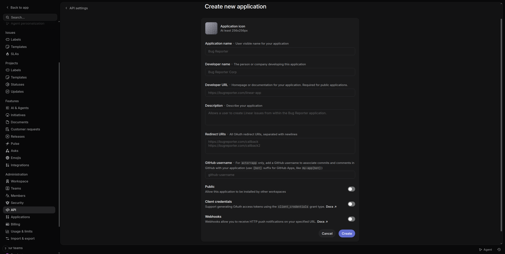

### Create the OAuth application

Open [Linear app creation](https://linear.app/negocio-chat/settings/api/applications/new) and create a new application.

Use your public WorkDock URL for the following endpoints.

For example, if WorkDock is available at:

```text
https://workdock.example.com
```

configure the following.

**Redirect URI**

```text
https://workdock.example.com/linear/oauth/callback
```

**Webhook URL**

```text
https://workdock.example.com/linear/webhook
```

Enable **webhooks** and copy the generated webhook signing secret into:

```text
WORKDOCK_LINEAR_WEBHOOK_SECRET
```

Under **App Events**, select:

::: important
**Agent session events**

Don't skip this event. WorkDock relies on it to receive agent session activity from Linear.
:::

Then click **Confirm**.

Finally, copy the OAuth application's **Client ID** and **Client Secret** into:

```text
WORKDOCK_LINEAR_CLIENT_ID
WORKDOCK_LINEAR_CLIENT_SECRET
```

### Tell WorkDock its public URL

Set:

```text
WORKDOCK_LINEAR_SERVER_URL=https://workdock.example.com
```

This is the public URL Linear uses when redirecting users back to WorkDock after OAuth authorization.

::: warning
The URL must be publicly reachable by Linear. `localhost` will not work for OAuth callbacks or webhooks.
:::

## 3.3 Connect GitHub

WorkDock needs GitHub access to work with repositories and pull requests.

You'll create a GitHub App and grant it only the repository permissions WorkDock requires.

::: info
For more information, see GitHub's documentation on [registering a GitHub App](https://docs.github.com/en/apps/creating-github-apps/registering-github-app/registering-a-github-app).
:::

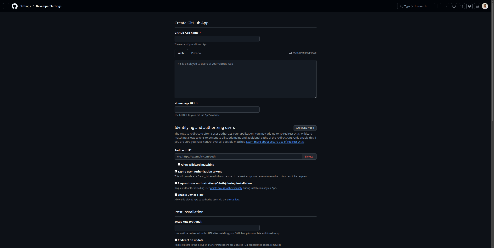

### Create the GitHub App

Open [GitHub App creation](https://github.com/settings/apps/new).

Make sure you're creating the application under the account or organization where you want the GitHub App to live.

You can create the app under:

- Your personal account
- An organization you own
- An organization where you have permission to manage GitHub Apps

### Configure webhooks

Enable **Webhooks** and set the payload URL to:

```text
https://workdock.example.com/github/webhook
```

Generate a strong webhook secret:

```bash
openssl rand -hex 32
```

Use the generated value as the GitHub App's **Webhook secret** and also add it to `.env`:

```text
WORKDOCK_GITHUB_WEBHOOK_SECRET=<generated-secret>
```

### Configure repository permissions

Under **Repository permissions**, grant:

| Permission | Access |
| --- | --- |
| Contents | Read and Write |
| Pull requests | Read and Write |

::: important
Don't reduce these permissions during setup. WorkDock requires **Read and Write** access to both **Contents** and **Pull requests** to work with repositories and pull requests.
:::

### Subscribe to events

Under **Subscribe to events**, enable:

::: important
**Pull request review comment**

Make sure this event is selected. WorkDock relies on it to receive review comments from GitHub.
:::

Create the application.

### Configure WorkDock

After the app is created, GitHub will provide a **Client ID**, **Client secret**, and the option to generate a **private key**.

Add the following to `.env`:

| Variable | Where to find it |
| --- | --- |
| `WORKDOCK_GITHUB_BOT_LOGIN_ID` | Bot login shown on the app's general page, e.g. `workdock[bot]` |
| `WORKDOCK_GITHUB_CLIENT_ID` | GitHub App Client ID |

Generate/download the GitHub App's private key and place it here:

```text
docker/workdock/github-app.pem
```

::: warning
**Keep the private key private.** Never commit `github-app.pem` to source control.
:::

## 3.4 Connect Daytona

WorkDock uses [Daytona](https://app.daytona.io/) to provide isolated execution environments for workloads.

You'll need a Daytona account and an API key with enough permissions for WorkDock to create and manage sandboxes.

1. Create a Daytona account at [https://app.daytona.io/](https://app.daytona.io/).
2. Create an API key with the following permissions:

   - **Read** access to sandboxes
   - **Write** access to sandboxes
   - **Delete** access to sandboxes
   - **Manage** access to secrets

   ::: important
   All four permission groups are required. In particular, make sure **Manage** access to secrets is enabled.
   :::

   For more information, see the [Daytona API Keys documentation](https://www.daytona.io/docs/api-keys).

3. Add the API key to `.env`:

```text
WORKDOCK_DAYTONA_API_KEY=<your-api-key>
```

For most installations, the default values for these settings are sufficient:

```text
WORKDOCK_DAYTONA_API_URL
WORKDOCK_DAYTONA_TARGET
```

::: tip
You normally don't need to change `WORKDOCK_DAYTONA_API_URL` or `WORKDOCK_DAYTONA_TARGET` unless you're using a custom Daytona deployment or located in `eu`.
:::

# 4. Start WorkDock

You've connected all the pieces. Now it's time to bring the engine online.

Run the deployment script again:

```bash
./scripts/docker-up.sh
```

This time, the script will:

1. Load the configuration from `.env`.
2. Generate the WorkDock configuration.
3. Generate the database migration configuration.
4. Run the database migrations.
5. Start the WorkDock engine.

If everything is healthy, WorkDock is ready.

### Your WorkDock instance

**WorkDock**

```text
http://localhost:8080
```

**SigNoz**

```text
http://localhost:8082
```

SigNoz gives you visibility into the WorkDock engine, including its traces, metrics, and logs.

::: tip
If WorkDock doesn't start successfully, SigNoz is the first place to look. Its logs, traces, and metrics can help you understand what the engine is doing and where something went wrong.
:::

# 5. Give WorkDock its first ticket

This is where the setup becomes useful.

::: important

Once WorkDock is running, connect a Linear workspace by opening:

```text
https://<your-workdock-url>/linear/oauth/authorize
```

:::

You'll be redirected to Linear to authorize the workspace.

After the workspace owner approves the connection:

1. Linear redirects back to WorkDock.
2. WorkDock securely stores the workspace access token in Infisical.
3. WorkDock begins accepting sessions from the authorized organization.

From there, you can start assigning tickets to your WorkDock deployment.

::: tip
The Linear workspace must be authorized by its workspace owner. WorkDock only processes sessions from organizations that have been explicitly authorized.
:::

**The infrastructure is running. The integrations are connected. The engine is ready. Now give it something to work on.**

# 6. Tear it down

When you need to completely remove the local WorkDock installation, run:

```bash
./scripts/docker-down.sh
```

This removes:

- All containers defined in `docker-compose.yaml`
- PostgreSQL, Redis, ClickHouse, Keeper, and SigNoz volumes
- Locally built WorkDock and PostgreSQL images
- Generated configuration files:
  - `docker/workdock/config.yaml`
  - `docker/workdock/tern.conf`
  - `.env`

::: warning
**This is destructive.**

`docker-down.sh` removes all persisted data, including your databases and observability data.

If you want to preserve your WorkDock state, back up the Docker volumes before running this command.
:::

